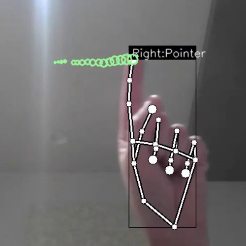

# hand-gesture-recognition-using-mediapipe
Estimate hand pose using MediaPipe (Python version).<br> This is a sample 
program that recognizes hand signs and finger gestures with a simple MLP using the detected key points.


This repository contains the following contents.
* Sample program
* Hand sign recognition model(TFLite)
* Finger gesture recognition model(TFLite)
* Learning data for hand sign recognition and notebook for learning
* Learning data for finger gesture recognition and notebook for learning

# Requirements
* mediapipe 0.8.1
* OpenCV 3.4.2 or Later
* Tensorflow 2.3.0 or Later<br>tf-nightly 2.5.0.dev or later (Only when creating a TFLite for an LSTM model)
* scikit-learn 0.23.2 or Later (Only if you want to display the confusion matrix) 
* matplotlib 3.3.2 or Later (Only if you want to display the confusion matrix)

# Demo
Here's how to run the demo using your webcam.
```bash
python app.py
```

The following options can be specified when running the demo.
* --device<br>Specifying the camera device number (Default：0)
* --width<br>Width at the time of camera capture (Default：960)
* --height<br>Height at the time of camera capture (Default：540)
* --use_static_image_mode<br>Whether to use static_image_mode option for MediaPipe inference (Default：Unspecified)
* --min_detection_confidence<br>
Detection confidence threshold (Default：0.5)
* --min_tracking_confidence<br>
Tracking confidence threshold (Default：0.5)

# Directory
<pre>
│  app.py
│  keypoint_classification.ipynb
│  point_history_classification.ipynb
│  
├─model
│  ├─keypoint_classifier
│  │  │  keypoint.csv
│  │  │  keypoint_classifier.hdf5
│  │  │  keypoint_classifier.py
│  │  │  keypoint_classifier.tflite
│  │  └─ keypoint_classifier_label.csv
│  │          
│  └─point_history_classifier
│      │  point_history.csv
│      │  point_history_classifier.hdf5
│      │  point_history_classifier.py
│      │  point_history_classifier.tflite
│      └─ point_history_classifier_label.csv
│          
└─utils
    └─cvfpscalc.py
</pre>
### app.py
This is a sample program for inference.<br>
In addition, learning data (key points) for hand sign recognition,<br>
You can also collect training data (index finger coordinate history) for finger gesture recognition.

### keypoint_classification.ipynb
This is a model training script for hand sign recognition.

### point_history_classification.ipynb
This is a model training script for finger gesture recognition.

### model/keypoint_classifier
This directory stores files related to hand sign recognition.<br>
The following files are stored.
* Training data(keypoint.csv)
* Trained model(keypoint_classifier.tflite)
* Label data(keypoint_classifier_label.csv)
* Inference module(keypoint_classifier.py)

### model/point_history_classifier
This directory stores files related to finger gesture recognition.<br>
The following files are stored.
* Training data(point_history.csv)
* Trained model(point_history_classifier.tflite)
* Label data(point_history_classifier_label.csv)
* Inference module(point_history_classifier.py)

### utils/cvfpscalc.py
This is a module for FPS measurement.

# Training
Hand sign recognition and finger gesture recognition can add and change training data and retrain the model.

### Hand sign recognition training
#### 1.Learning data collection
Press "k" to enter the mode to save key points（displayed as 「MODE:Logging Key Point」）<br>
<br><br>
If you press "0" to "9", the key points will be added to "model/keypoint_classifier/keypoint.csv" as shown below.<br>
1st column: Pressed number (used as class ID), 2nd and subsequent columns: Key point coordinates<br>
<br><br>
The key point coordinates are the ones that have undergone the following preprocessing up to ④.<br>

<br><br>
In the initial state, three types of learning data are included: open hand (class ID: 0), close hand (class ID: 1), and pointing (class ID: 2).<br>
If necessary, add 3 or later, or delete the existing data of csv to prepare the training data.<br>
　　

#### 2.Model training
Open "[keypoint_classification.ipynb](keypoint_classification.ipynb)" in Jupyter Notebook and execute from top to bottom.<br>
To change the number of training data classes, change the value of "NUM_CLASSES = 3" <br>and modify the label of "model/keypoint_classifier/keypoint_classifier_label.csv" as appropriate.<br><br>

#### X.Model structure
The image of the model prepared in "[keypoint_classification.ipynb](keypoint_classification.ipynb)" is as follows.
<br><br>

### Finger gesture recognition training
#### 1.Learning data collection
Press "h" to enter the mode to save the history of fingertip coordinates (displayed as "MODE:Logging Point History").<br>
<br><br>
If you press "0" to "9", the key points will be added to "model/point_history_classifier/point_history.csv" as shown below.<br>
1st column: Pressed number (used as class ID), 2nd and subsequent columns: Coordinate history<br>
<br><br>
The key point coordinates are the ones that have undergone the following preprocessing up to ④.<br>
<br><br>
In the initial state, 4 types of learning data are included: stationary (class ID: 0), clockwise (class ID: 1), counterclockwise (class ID: 2), and moving (class ID: 4). <br>
If necessary, add 5 or later, or delete the existing data of csv to prepare the training data.<br>
　　　

#### 2.Model training
Open "[point_history_classification.ipynb](point_history_classification.ipynb)" in Jupyter Notebook and execute from top to bottom.<br>
To change the number of training data classes, change the value of "NUM_CLASSES = 4" and <br>modify the label of "model/point_history_classifier/point_history_classifier_label.csv" as appropriate. <br><br>

#### X.Model structure
The image of the model prepared in "[point_history_classification.ipynb](point_history_classification.ipynb)" is as follows.
<br>
The model using "LSTM" is as follows. <br>Please change "use_lstm = False" to "True" when using (tf-nightly required (as of 2020/12/16))<br>


# Reference
* [MediaPipe](https://mediapipe.dev/)

